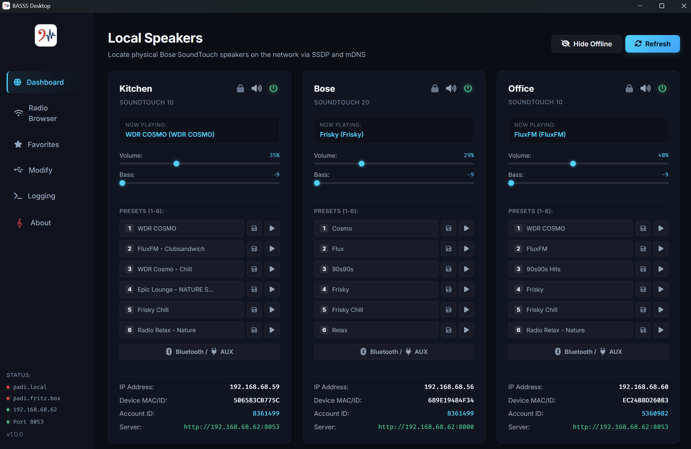
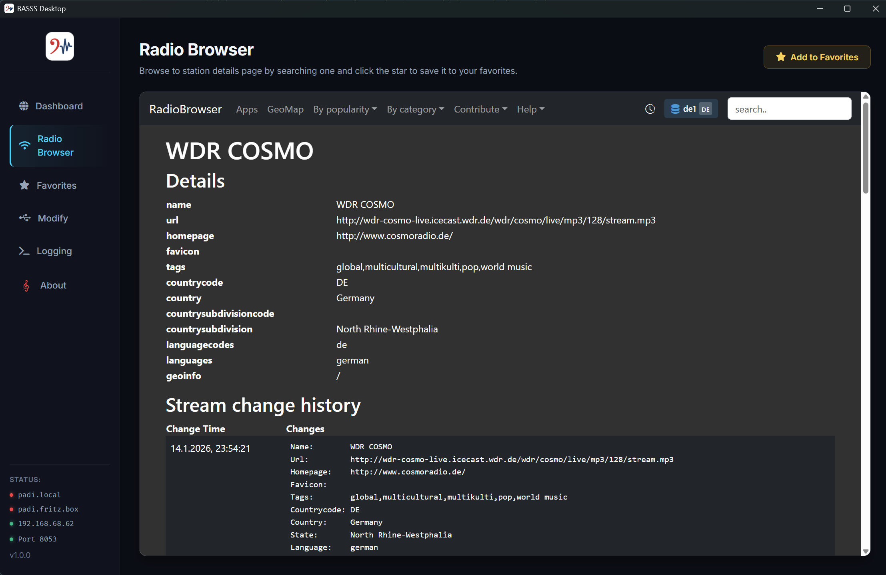
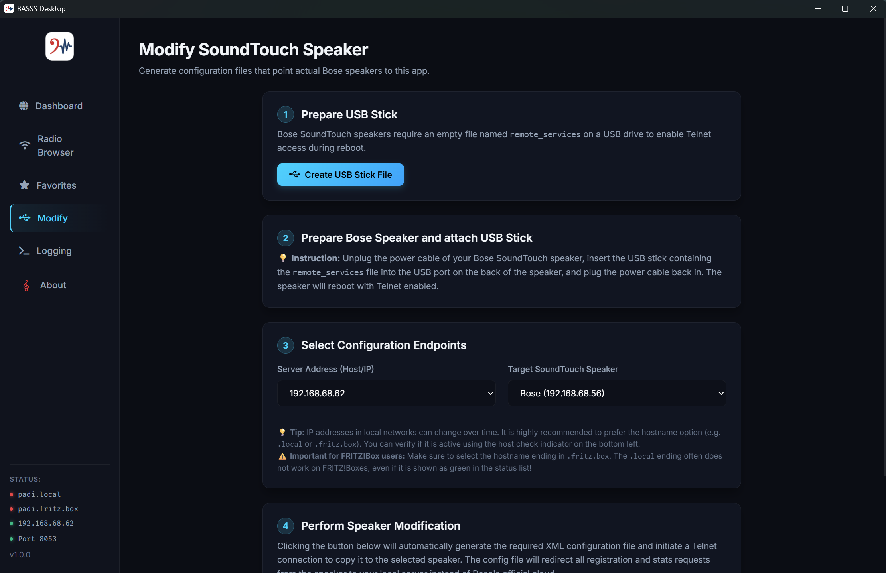

# BASSS (Broadcast App and Server for SoundTouch Speakers)
[](https://github.com/hxmelab/basss/blob/master/LICENSE)
[](https://github.com/hxmelab/basss/releases/latest)
[](https://github.com/hxmelab/basss/releases)
[](https://ko-fi.com/O4O4NNOCL)

BASSS is a lightweight, easy-to-use, local, and private alternative designed to rescue Bose SoundTouch speakers from the official cloud server shutdown. 

By bypassing the deprecated official cloud server and running entirely on your local home network, BASSS combines a local Node.js/Express server (listening on port `8053`) with an elegant Electron desktop frontend to keep your speakers fully operational. 

Unlike other smart home servers, **BASSS does not need to run 24/7**. Once configured, the speakers stream radio stations directly from the web. The app is only needed if a speaker is completely disconnected from power to sync settings on startup, or to change presets and browse radio stations.

---

## Screenshots

### 1. Dashboard View


### 2. Radio Browser & Favorites


### 3. Modification Wizard


---

## Key Features

* **No Account Required**: No need to create an account or log in to use BASSS. Simply open the app and it will automatically discover your speakers.
* **Device-Specific Presets**: Presets are bound directly to your speakers instead of a shared global user account. Hence, every speaker can have its own presets. 
* **Radio Browser Integration**: Search over thousands of global radio streams powered by the free community-driven `radio-browser.info` directory and assign them directly to speaker presets.
* **Autonomy**: Speakers connect directly to the audio stream URLs. You can safely close the BASSS app once configured. No need to run BASSS 24/7.
* **Boot Recovery**: Only, if a speaker gets unplugged from power, simply open BASSS for a moment while the speaker is booting, let it sync its configuration, and it will be autonomous again. You can close BASSS afterwards. All your presets stay available on the speaker. 
* **Local Emulation Server**: Built-in Express server listening on a local port on your computer to intercept and serve speaker registration and preset requests locally.
* **Modification Wizard**: A step-by-step assistant that helps you to reconfigure the speakers. Super easy and safe!
* **Real-Time Synchronisation**: Uses the speaker's native protocol to synchronize volume, bass, presets, standby, and now-playing metadata instantly.
* **No Ads**: This app is ad-free.

---

## Download & Installation 

### On Windows
Just download and run `BASSS-Desktop.exe` on Windows. A confirmation dialog will appear asking you to allow access to run the local server on port 8053. 
* [Download BASSS for Windows 64-bit](https://github.com/hxmelab/basss/releases/download/v1.0.0/BASSS-Desktop.exe)

### On MacOS
Download `BASSS-Desktop.dmg` and run the app on macOS. MacOS will warn you that it's an unknown publisher. Due to this open source project being unsigned, you will have to allow it to run.
* [Download BASSS for macOS 64-bit](https://github.com/hxmelab/basss/releases/download/v1.0.0/BASSS-Desktop.dmg)

## Developer Guide

### Prerequisites
*   [Node.js](https://nodejs.org/) (v16 or higher recommended)
*   [npm](https://www.npmjs.com/) (bundled with Node.js)

### Development Setup
1.  Clone this repository or extract the project files.
2.  Install dependencies:
    ```bash
    npm install
    ```
3.  Start the application in development mode (launches the Express server and Electron window):
    ```bash
    npm run electron
    ```

### Production Packaging
BASSS uses `electron-builder` to package standalone executable packages.

*   **For Windows** (creates an installer `.exe` and a portable executable inside `dist/`):
    ```bash
    npm run build:win
    ```
*   **For macOS** (creates `.dmg` and `.zip` archives inside `dist/` - *requires a macOS host*):
    ```bash
    npm run build:mac
    ```
*   **For the local platform**:
    ```bash
    npm run build
    ```

---

## Technical Details & Architecture

```
BASSS/
├── data/                  # Local datastores (dev mode only)
│   ├── devices.json       # Configured speakers, presets & settings
│   └── favorites.json     # Saved favorite radio stations
├── media/                 # Assets (App icons, screenshots)
├── src/
│   ├── renderer/          # Frontend assets (HTML, CSS, JS)
│   │   ├── index.html     # Main UI window structure
│   │   ├── index.css      # Custom styling, dark theme, transitions
│   │   └── renderer.js    # UI event handlers and IPC client
│   ├── resources/         # XML configuration templates for Bose speakers
│   ├── datastore.js       # Persistent file-based JSON storage controller
│   ├── discovery.js       # SSDP & mDNS speaker scanner
│   ├── routes.js          # REST endpoints emulating the Bose Marge API
│   ├── server.js          # Express backend server with startup health-checks
│   └── service.js         # SoundTouch business logic and XML builders
├── main.js                # Electron main process (system window, IPC router, DNS checks)
├── preload.js             # Electron bridge API (contextBridge)
├── package.json           # Scripts, dependencies, and builder config
└── LICENSE                # MIT license file
```

### Data Storage
To support read-only directory packaging, BASSS uses dynamic persistent storage:
*   **Development Mode**: Saves locally under `./data/devices.json` and `./data/favorites.json`.
*   **Packaged Mode (Production)**: Saves in your operating system's user profile data directory to prevent write errors:
    *   **Windows**: `C:\Users\<username>\AppData\Roaming\basss\data\`
    *   **macOS**: `~/Library/Application Support/basss/data/`

### How the Speaker Redirection Works
By default, SoundTouch speakers try to contact Bose's cloud servers. BASSS works by deploying a configuration file to the speaker's internal storage. 

This config override redirects registration, statistics, and sync requests to your computer instead of the official Bose cloud. This is safe, risk-free, and can be undone at any time. 

---

## Support & Donation

If BASSS rescued your Bose speakers and saved you the cost of buying new ones, please consider supporting the development. Your donation keeps active development and community support alive!

You can support my work directly on [Ko-fi](https://ko-fi.com/homelab).

---

## License

This project is licensed under the MIT License - see the [LICENSE](LICENSE) file for details.

*Disclaimer: This application is an independent, open-source project. Bose and SoundTouch are trademarks of Bose Corporation. This application is concluded between the developer and the end-user only. Bose Corporation does not in any way endorse, approve of, or sponsor this application.*
